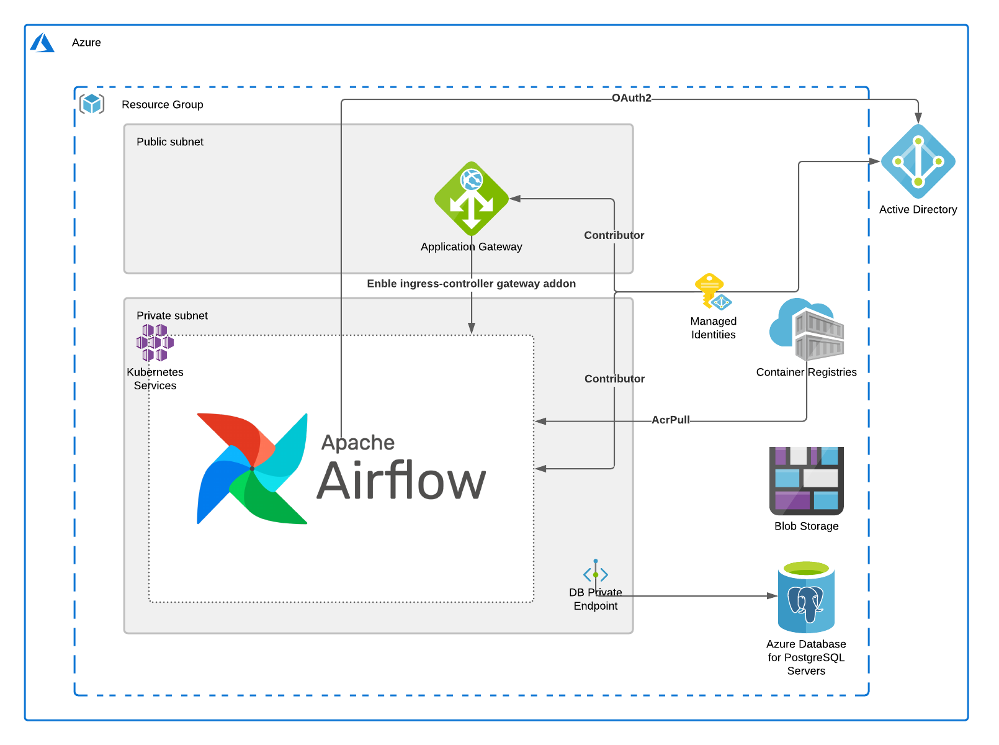

## Architecture


## Prerequisites
Assuming below cli modules are installed and configured
- Terraform
- Docker
- Openssl
- AZ Cli
## Generate Certificate using OpenSSL
```sh
  cd terraform
  openssl genrsa 2048 > private.pem
  openssl req -x509 -new -key private.pem -out public.pem
  openssl pkcs12 -export -in public.pem -inkey private.pem -out mycert.pfx
```

## Installation
```sh
  az login
  # Before running terraform scripts verify certificate file generated
  terraform init
  terraform plan
  terraform apply
```

## Verify installation
Note:- Assign user to newly provisioned AKS cluster admin group
```sh
az aks get-credentials -n <AKS NAME> -g <RG NAME> --overwrite-existing
kubectl get nodes
#Expect device login message here 
```

## Destroy
```sh
  terraform destroy
```